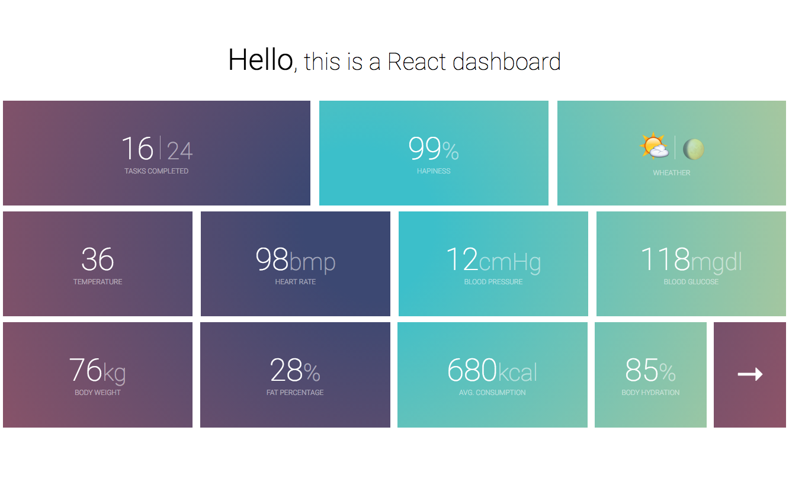

This a little Dasbhoard example built in React



It is an exercise about how built the example taken from [Multiple.js](https://github.com/NeXTs/Multiple.js) with React, css loaders and ES6 flavour

## Install

```js
npm install
npm run dev
```

